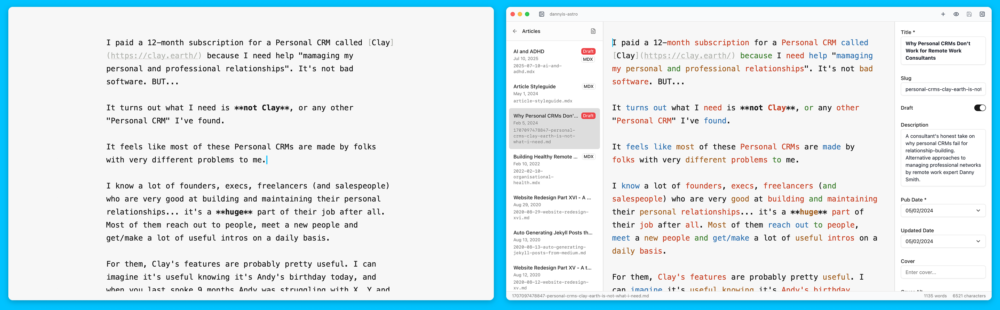

# Astro Editor



A native macOS markdown editor for Astro content collections. Clean writing interface with automatic frontmatter editing based on your collection schemas.

https://github.com/user-attachments/assets/89b87f98-88c0-4845-a020-284201464b86

## Features

**Writing Environment**
- Clean markdown/MDX editor with syntax highlighting. Frontmatter and imports are hidden while editing, shown in a dedicated sidebar.
- Focus mode (highlights current sentence), typewriter mode (cursor stays centered), and copyedit mode (highlights parts of speech).
- Image preview on hover (Option + hover over paths).
- Comprehensive keyboard shortcuts for formatting, headings, and navigation.
- Auto-save every 2 seconds with crash recovery.

**Frontmatter & Schema Integration**
- Generates editing forms from your Astro collection schemas with proper validation.
- Supports all Zod types: strings, numbers, dates, booleans, enums, arrays, nested objects, references, and image fields.
- Image fields provide drag-and-drop with automatic copying to your assets directory.
- Field constraints (min/max, character limits) enforced in the UI.

**MDX Components**
- `Cmd + /` opens component builder showing all components in your `src/components/mdx/` directory.
- Supports Astro, React, Vue, and Svelte components.
- Automatically detects available props and lets you tab through values after insertion.

**File Management**
- Collections and files automatically discovered from your `content.config.ts`.
- Full support for subdirectories within collections.
- Files sorted by publication date (configurable field name) with draft indicators.
- Context menu for rename, duplicate, reveal in Finder, copy path.
- Command palette (`Cmd + K`) for quick file switching and command access.

**Project Configuration**
- Per-project and per-collection settings for custom directory structures.
- Configurable field mappings (title, date, draft, description fields).
- Light/dark theme with system integration.
- IDE integration (open files/projects in VSCode, Cursor, etc.).

## Supported Astro Projects

- **Astro Version**: 5.x (may work with 4.x but expect bugs)
- **Content Collections**: Must use the `glob` loader and have a schema defined with `defineCollection`
- **Configuration**: Requires `src/content/config.ts` or `src/content.config.ts`

Non-markdown/MDX files in collections are ignored.

Default directory structure (all paths are configurable per project and per collection):

```
my-astro-site
└── src
    ├── assets/mycollection/      # Images and media
    ├── components/mdx/            # Astro/React/Vue/Svelte components for MDX
    ├── content/mycollection/      # Markdown and MDX files
    └── content.config.ts          # Collection definitions
```

## Installation

Download the [latest Release](https://github.com/dannysmith/astro-editor/releases)

## Documentation

- **[User Guide](docs/user-guide.md)** - Complete feature documentation
- **[Contributing](docs/CONTRIBUTING.md)** - Development setup and guidelines

## Disclaimer

Work in progress. Commit your Astro project regularly when using the editor.

## Contributing

Bug reports and feature requests are welcome. See the [issue tracker](https://github.com/dannysmith/astro-editor/issues).

**Project Philosophy:**
- This is a tool for "writer mode", not "coder mode". Features related to git, publishing, deployment, or code editing are out of scope.
- The UI is intentionally opinionated for simplicity. Customization options are limited to what's needed to work with different Astro project structures.

Pull requests welcome. See [CONTRIBUTING.md](docs/CONTRIBUTING.md) for development setup.

## Roadmap

See the [GitHub Project](https://github.com/users/dannysmith/projects/5/)

## Credits

- [iA Writer](https://ia.net/writer) for inspiration and [typography](https://github.com/iaolo/iA-Fonts)
- [DarkMatter](https://getdarkmatter.dev/) by [Vadim Demedes](https://vadimdemedes.com/)

## Development

See [CONTRIBUTING.md](docs/CONTRIBUTING.md) and [developer docs](docs/developer/) for setup and architecture details.

**Quick start:**
```bash
pnpm install
pnpm reset:testdata  # Creates test Astro project
pnpm run tauri:dev   # Starts dev server
```
