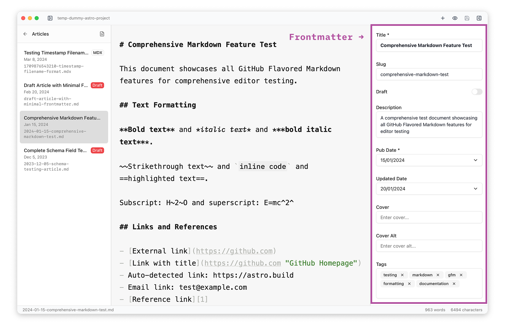
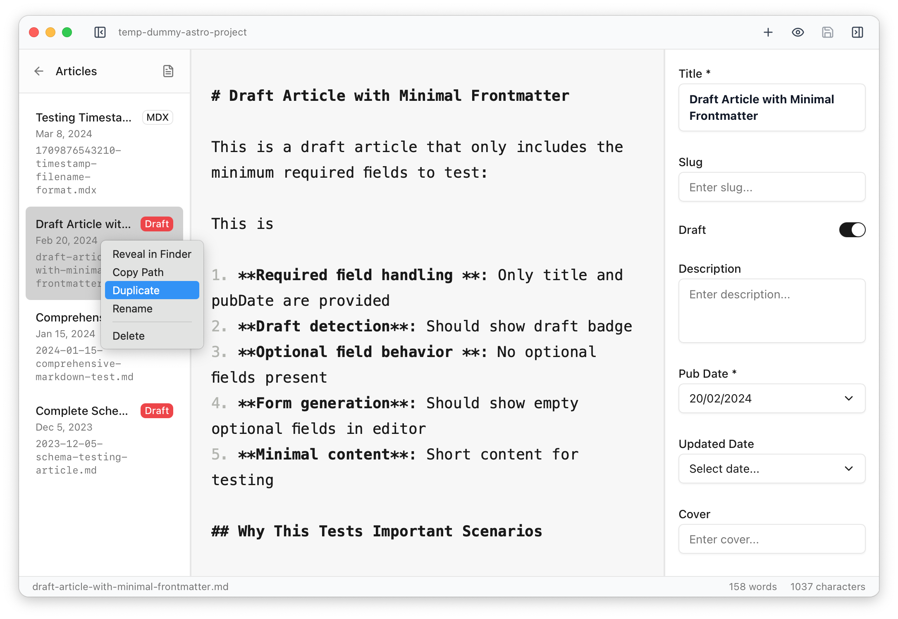
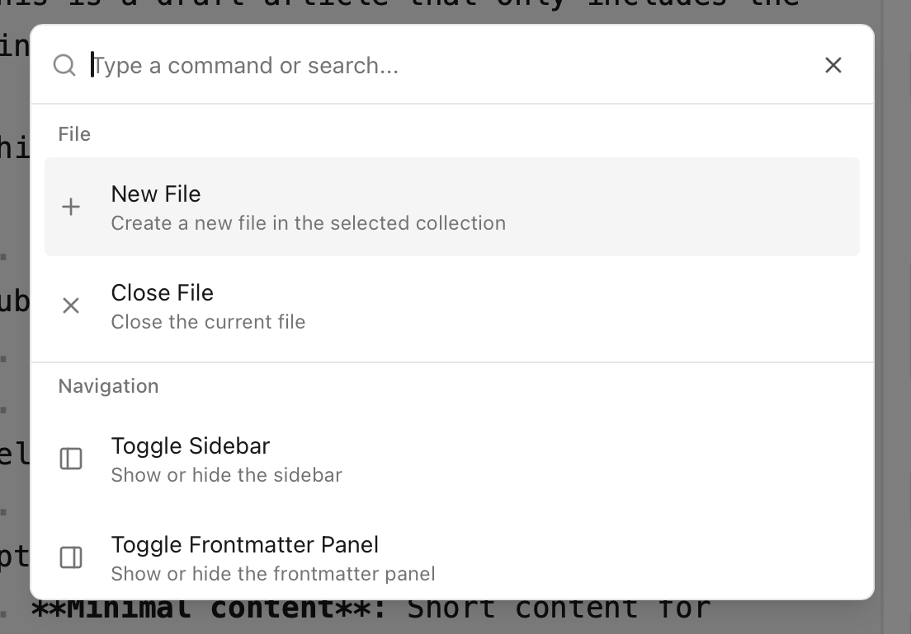
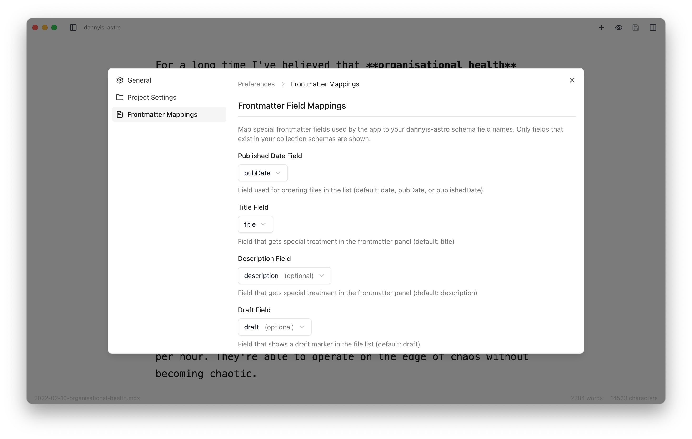

# Astro Editor User Guide


## Overview

Astro Editor provides a clean, pleasant user experience for authoring and editing [Markdown](https://www.markdownguide.org/) & [MDX](https://mdxjs.com/) files in the content collections of local [Astro](https://astro.build/) sites.

### Philosophy

Most folks who publish content with Astro work in two distinct _modes_. We're in **coder mode** when we're editing Astro components, pages, CSS etc. This is best done in a _coding tool_ like VSCode. Whe're in **writer mode** when we're writing or editing prose in markdown. Editors designed for coding are not well suited to this - they have too many distractions and lack the kinds of tools which help with writing and editing prose.

Because of this, it's common for folks to **write** in tools like iA Writer or Obsidian and then switch to VSCode to add frontmatter, build and publish. The workflow often looks something like this:

1. Create a new draft markdown file & start writing
2. Edit and tweak (maybe over a number of sessions)
3. Add frontmatter for things like description, tags etc
4. Build & run locally to check everything works
5. Push to github and deploy/publish

Steps 1-3 are very much _writer mode_ tasks, while 4 & 5 are definitely _coder mode_ tasks. Astro Editor is only concerned with the former, which means:

- Code blocks are not syntax highlighted. If you have code examples in your files you're better off authoring them in a coding tool which can properly lint, format and check your code examples.
- There's no mechanism for comitting or publishing in Astro Editor. You should do that in a code editor or terminal.
- There's no way to preview your writing. The best way to do that is by running your astro site locally with `pnpm run dev` and looking at it there.

Because the goal of this **simplicity when in writer mode**, Astro Editor is intentionally opinionated about its UI and limits the user customisation features to _"making it work with your Astro project and no more"_. It's not possible to customise the colour schemes, typeface etc. If you need fine-grained customization & extensibility we recommend using a custom profile in VSCode (or Obsidian) which you've set up for Markdown editing.

### Astro Requirements

Astro Editor will only work properly with Astro projects which:

- Are using Astro 5+ _(it might work with Astro 4+ but you should expect a few bugs)_
- Use Astro [Content Collections](https://docs.astro.build/en/guides/content-collections/) and have a `src/content/config.ts` file.
- Have at least one collection defined with `defineCollection`. It **must** use the `glob` loader and have a `schema`.
- Have all collections in a single directory: `src/content/[collectionname]`

Content collections can contain non-markdown/MDX files, but they will not be shown in the editor.

Some features require you to have certain properties in your schema. A date field is required for proper ordering in the file list. A boolean field is required to show and filter drafts. A text field is required to show titles in the sidebar. Etc.

By default, Astro Editor expects the following structure in your Astro project:

```
my-astro-site
└── src
    ├── assets
    │   └── mycollection
    │       └── image1.png
    ├── content
    │   └── mycollection
    │       └── blog-post.mdx
    ├── components
    │   └── mdx
    │       └── ExampleAstroComponent.astro
    └── content.config.ts
```

The paths to the _Assets_, _Content_, and _MDX Components_ directories (relative to the project root) are configurable per project, but their internal structures are not.

### Directory Restrictions

For security reasons, Astro Editor cannot open projects located in certain system directories. If you attempt to open a project in one of these locations, you'll see an error message asking you to choose a different location.

**Restricted directories:**

- `/System/` - macOS system files
- `/usr/` - Unix system resources
- `/etc/` - System configuration files
- `/bin/` and `/sbin/` - System binaries
- `/Library/Frameworks/` and `/Library/Extensions/` - System frameworks
- `~/Library/Keychains/` - Keychain data
- `~/.ssh/` - SSH keys and configuration
- `~/.aws/` - AWS credentials
- `~/.docker/` - Docker configuration

These restrictions help protect sensitive system files while still allowing you to open Astro projects stored in typical development locations like `~/Documents/`, `~/Desktop/`, `~/Projects/`, or anywhere else outside the restricted areas.

### Quick Start

Getting started with Astro Editor takes just a few steps. The application is designed to work with existing Astro projects that use content collections.

1. **Open an Astro Project**: Use `File > Open Project` to select your Astro project directory. Astro Editor will automatically scan for content collections defined in your `src/content/config.ts` file.

2. **Select a Collection**: Once your project opens, you'll see your content collections listed in the left sidebar. Click on any collection name to view the files it contains.

3. **Open a File**: Click on any markdown or MDX file in the file list to open it in the main editor. The editor will show your content without the frontmatter, which appears in the right sidebar.

4. **Start Writing**: Begin editing. Your changes are automatically saved every 2 seconds, and you can manually save anytime with `Cmd+S`.

5. **Edit Frontmatter**: Use the right sidebar to edit metadata fields. These forms are automatically generated from your Astro content collection schemas.

That's it. Astro Editor handles project discovery, file management, and frontmatter editing automatically based on your existing Astro setup.

### Interface Overview


Astro Editor uses a clean three-panel layout designed to minimize distractions while providing easy access to files and metadata:

| Interface Area    | Purpose                                                                      |
| ----------------- | ---------------------------------------------------------------------------- |
| **Left Sidebar**  | Browse collections and files, with draft indicators and context menu options |
| **Main Editor**   | Clean writing space with markdown syntax highlighting                        |
| **Right Sidebar** | Dynamic frontmatter forms generated from your Astro collection schemas       |
| **Top Bar**       | Project name, window controls, and menu access                               |
| **Status Bar**    | Shows current file, save status, and word count                              |

Both sidebars can be hidden using `Cmd+1` (left) and `Cmd+2` (right) for distraction-free writing. The panels remember their sizes and visibility between sessions.

## The Editor

The editor window shows the entire contents of your markdown or MDX files with the exception of the YAML frontmatter and any JSX `import` lines immediately following the frontmatter. It's designed to provide an extremely clean writing interface, especially when both sidebars are closed. It provides markdown syntax highlighting.

### Auto-Save

Astro Editor automatically saves your work while you're editing (configurable in preferences, default is 2 seconds). You'll see a brief "Saved" notification in the status bar when auto-save occurs. You can also manually save at any time using `Cmd+S`.

### Editor Keyboard Shortcuts

Astro Editor includes the following keyboard shortcuts.

| Shortcut     | Action            | Description                                |
| ------------ | ----------------- | ------------------------------------------ |
| `Cmd+B`      | Bold              | Toggle bold formatting for selected text   |
| `Cmd+I`      | Italic            | Toggle italic formatting for selected text |
| `Cmd+K`      | Link              | Create or edit a link for selected text    |
| `Cmd+]`      | Indent Right      | Indent current line right                  |
| `Cmd+[`      | Indent Left       | Indent current line left                   |
| `Cmd+Z`      | Undo              | Undo the last edit action                  |
| `Cmd+Y`      | Redo              | Redo the last undo action                  |
| `Ctrl+Cmd+F` | Toggle Focus Mode | Enable/disable focus writing mode          |
| `Opt+Click`  | Open URL          | Open URL under mouse cursor in browser     |
| `Opt+Cmd+1`  | Heading 1         | Convert current line to H1                 |
| `Opt+Cmd+2`  | Heading 2         | Convert current line to H2                 |
| `Opt+Cmd+3`  | Heading 3         | Convert current line to H3                 |
| `Opt+Cmd+4`  | Heading 4         | Convert current line to H4                 |
| `Opt+Cmd+0`  | Plain Text        | Convert current line to plain paragraph    |

## The Frontmatter Sidebar

The frontmatter sidebar automatically generates editing forms based on your Astro content collection schemas. This means you get proper validation, appropriate input types, and a clean editing experience without any manual configuration.

### How Schema Parsing Works

Astro Editor uses a two-tier approach to read your content collection schemas:

**Primary Method: JSON Schema** (Recommended)
Astro Editor first looks for JSON schema files generated by Astro in your `.astro/collections/` directory. These files (like `blog.schema.json`) contain complete type information and metadata about your collection fields.

To ensure these files are available:
1. Run `pnpm run dev` or `astro sync` in your project directory
2. Astro will automatically generate schema files in `.astro/collections/`
3. Astro Editor reads these schemas and builds the frontmatter forms

**Fallback Method: Zod Schema Parsing**
If JSON schema files aren't found, Astro Editor falls back to parsing your Zod schema definitions directly from `src/content/config.ts`. This works for most cases but has limitations with complex schemas, imported types, or third-party schema definitions.

**Best Practice**: Always run `astro sync` after modifying your content collection schemas to ensure Astro Editor has the latest field definitions.

### How Schema Fields Become Forms

Astro Editor converts schema definitions into appropriate form controls. The mapping works as follows:

| Zod Schema Type           | Form Control      | Behavior                           |
| ------------------------- | ----------------- | ---------------------------------- |
| `z.string()`              | Single-line input | Standard text input                |
| `z.string().optional()`   | Single-line input | Empty field allowed, no validation |
| `z.enum(['a', 'b', 'c'])` | Dropdown select   | Shows all enum options             |
| `z.boolean()`             | Toggle switch     | True/false with visual switch      |
| `z.date()`                | Date picker       | Native date selection widget       |
| `z.number()`              | Number input      | Numeric validation and steppers    |
| `z.array(z.string())`     | Tag input         | Add/remove tags with keyboard      |

### Special Field Handling

**Title Fields**: If your schema has a field named `title` (or configured in project settings), it renders as a larger, bold textarea that automatically expands as you type. Title fields always appear first in the panel, regardless of their position in the schema.

**Description Fields**: Fields named `description` get a multi-line textarea that grows based on content length.

**Required Fields**: Required schema fields show an asterisk (\*) next to their label and prevent saving if empty.

### Field Order and Defaults

Fields appear in the sidebar in the same order they're defined in your Zod schema. When you create a new file, any default values specified in your schema are automatically applied in the panel.

The frontmatter is written to your file in the same order it's shown in the schema, with any non-schema fields shown in alphabetical order by field name.



## The File List Sidebar

The left sidebar provides your primary interface for navigating between files and collections in your Astro project.

### Collections and File Organization

**Collection Selection**: Click on any collection name to view its files. The currently selected collection is highlighted, and its files appear below.

**File Ordering**: Files are automatically sorted by their publication date (newest first), using the date field configured in your project settings (defaults to `pubDate`, `date`, or `publishedDate`). Files without dates appear at the top of the list.

**File Display**: Each file shows:

- **Title**: Taken from the `title` frontmatter field, or the filename if no title exists
- **Date**: Publication date in a readable format (e.g., "Dec 15, 2023")
- **Draft Badge**: Yellow "Draft" indicator for files marked as drafts

### Draft Management

**Draft Detection**: Files are automatically detected as drafts when their `draft` frontmatter field (or configured equivalent) is set to `true`.

**Draft Filtering**: Use the "Show Drafts Only" toggle in the toolbar to filter the file list to show only draft files. This is useful when reviewing unpublished content.

### File Operations

**Opening Files**: Click any file to open it in the main editor. The currently open file is highlighted with a border.

**Context Menu**: Right-click any file to access additional operations:

- **Rename**: Edit the filename inline without changing file content
- **Duplicate**: Create a copy of the file with a new name
- **Reveal in Finder**: Open the file's location in the Finder
- **Copy Path**: Copies the file's absolute path to the clipboard

**Creating New Files**: Use `Cmd+N` or the "New File" button to create a new file in the currently selected collection. You'll be prompted to enter a filename, and the file will be created with default frontmatter from your collection schema.



## The Command Palette



The command palette provides quick access to all major functions in Astro Editor. It's designed for keyboard-driven workflows and fast file switching.

**Opening the Palette**: Press `Cmd+K` from anywhere in the application to open the command palette. Start typing immediately to search.

**Fuzzy Search**: The palette uses intelligent fuzzy matching, so you can type partial words or abbreviations. For example, typing "foc" will find "Toggle Focus Mode".

### Command Categories

Commands are organized into logical groups that appear at the top of the search results:

**File Operations**

- **New File**: Create a new file in the current collection
- **Save File**: Save the currently open file
- **Close File**: Close the current file

**Navigation**

- **Open Collection**: Jump to a different content collection
- **Toggle Sidebar**: Show/hide the left file browser
- **Toggle Frontmatter Panel**: Show/hide the right frontmatter editor

**Project Management**

- **Open Project**: Select and open a different Astro project
- **Reload Collections**: Refresh the project's content collections
- **Open in IDE**: Open the current project, collection, or file in your configured IDE.

### File Search

The command palette doubles as a powerful file search tool. When you type text that doesn't match a command, it automatically searches across all files in your project:

**Cross-Collection Search**: Finds files in any collection, not just the currently selected one.

**Title and Filename Matching**: Searches both the frontmatter title and the actual filename.

**Quick Switching**: Select any file from the search results to open it immediately, even if it's in a different collection.

### Opening in Your IDE

The "Open in IDE" command launches your preferred code editor with either the current file or the entire project. Configure your IDE command in preferences (`Cmd+,`). Popular options include:

- `code` for Visual Studio Code
- `cursor` for Cursor
- `subl` for Sublime Text

## Editing Modes

A number of "modes" can be toggled while writing/editing, which alter how the editor displays your content. These are generally compatible with each other (they can be toggled on and off independently).

### Focus Mode

Dims everything but the current sentence (or line for lists). Can be toggled with the 👁️ icon in the toolbar.

### Typewriter Mode

> [!WARNING]
> This is currently unreliable and could cause the editor window to behave in unexpected ways.

Keeps the editor cursor centered vertically in the window and scrolls the document – much like a typewriter.

### Copyedit Highlighting


Copyedit mode highlights different parts of speech in your writing with distinct colors, helping you analyze writing patterns and identify areas for improvement.

**Parts of Text Highlighted**:

- **Nouns**: Purple highlighting to identify subjects and objects
- **Verbs**: Blue highlighting to spot action words and tense patterns
- **Adjectives**: Green highlighting to review descriptive language
- **Adverbs**: Orange highlighting to catch potentially unnecessary modifiers
- **Conjunctions**: Red highlighting to see sentence connection patterns

**Individual Controls**: You can toggle highlighting for specific parts of speech using the command palette.

**Smart Exclusions**: Highlighting automatically excludes code blocks and markdown syntax, so only your actual prose is analyzed.

**Writing Use Cases**:

- Spot overuse of adverbs in your writing
- Check for consistent verb tenses
- Review the density of adjectives in descriptions
- Identify complex sentence structures with many conjunctions

_[Screenshot needed: Editor with copyedit mode enabled showing different colored highlights]_

## MDX Components

When editing an MDX file, `Cmd+/` will open the component builder. This will show all the components inside your configured "/components/mdx" directory. You can select a component to insert and toggle the props you want in the next panel. Pressing `Cmd+Enter` will insert the component into your document, where you can tab through the various props.

_[Gif needed: Using the component builder]_

## Preferences & Configuration

Astro Editor provides global preferences, project-specific settings, and collection-scoped overrides to accommodate different workflows and project structures.

### General Preferences



Access global preferences through `Cmd+,` or the application menu. These settings apply across all projects:

**Theme**: Choose between light mode, dark mode, or system theme (follows macOS setting).

**IDE Command**: Configure the command used for "Open in IDE" functionality. Common values:

- `code` for Visual Studio Code
- `cursor` for Cursor
- `subl` for Sublime Text

**Important**: Global settings contain ONLY truly global preferences (theme, IDE command, copyedit highlights, auto-save delay). There are no global defaults for project or collection settings.

### Project Settings

Each project has its own settings that apply to the entire project. Access project settings through the preferences panel (only visible when a project is open).

**Path Overrides**: Customize directory locations if your project uses non-standard paths:

- **Content Directory**: Default is `src/content/`, but you might use `content/` or `docs/`
- **Assets Directory**: Default is `src/assets/`, useful for projects using `public/images/` or `static/`

Project-level path overrides apply to all collections unless a collection has its own override.

### Collection Settings

**New**: You can now configure settings for individual collections, allowing different collections to have different paths and field mappings.

**When to Use Collection Settings**:
- Blog posts in `content/blog/` while docs remain in `src/content/docs/`
- Different collections using different field names (e.g., blog uses `publishDate`, docs use `date`)
- Collection-specific asset directories (e.g., blog images in `public/blog-images/`)

**Available Collection Settings**:

**Path Overrides** (per collection):
- **Content Directory**: Where this collection's files are located (absolute path from project root)
  - Example: `content/blog/` means files are in `<project_root>/content/blog/`, not `<project_root>/src/content/blog/`
- **Assets Directory**: Where this collection's assets should be copied (absolute path from project root)
  - Example: `public/blog-images/` for blog, `public/docs-images/` for docs

**Frontmatter Field Mappings** (per collection):
- **Title Field**: Which field to use for file titles in sidebar (e.g., `title` or `heading`)
- **Date Field**: Which field(s) to use for sorting files (e.g., `publishDate` or `["pubDate", "date"]`)
- **Description Field**: Which field to style as a textarea (e.g., `description` or `summary`)
- **Draft Field**: Which boolean field indicates draft status (e.g., `draft` or `published`)

**How Settings Work (Three-Tier Fallback)**:

When Astro Editor needs a setting (like content directory), it looks in this order:
1. **Collection setting** (if configured for this collection)
2. **Project setting** (if configured at project level)
3. **Hard-coded default** (built into the app)

**Example**: If you set project content directory to `content/`, all collections use `content/`. But if you configure the "blog" collection to use `content/blog-posts/`, only the blog collection uses that path while other collections still use `content/`.

### Settings Storage

Settings are automatically saved to your system:

- **Location**: `~/Library/Application Support/is.danny.astroeditor/`
- **Global Settings**: Theme, IDE command, and other app-wide preferences
- **Project Registry**: Remembers all opened projects and their metadata
- **Project Files**: Individual settings files for each project (includes collection overrides)
- **Auto-Recovery**: Settings persist across app restarts and crashes

Projects are identified by their `package.json` name and automatically migrate if you move the project folder.

## Troubleshooting & Support

If you're experiencing issues with Astro Editor, you can collect detailed logs to help with troubleshooting.

### Getting Diagnostic Logs

Astro Editor automatically logs detailed information to help diagnose setup problems, crashes, or other issues.

**To collect logs for support:**

**Method 1: Complete Log File (Recommended)**

1. **Open Finder** and navigate to: `~/Library/Logs/is.danny.astroeditor/`
2. **Copy the file** `Astro Editor.log`
3. **Send this file** along with a description of your issue

**Method 2: Console.app for Live Monitoring**

1. **Open Console.app** (Applications > Utilities > Console)
2. **Search for "Astro Editor"** in the search bar
3. **Reproduce the issue** you're experiencing (try opening the project again, etc.)
4. **Filter the results** by typing "Astro Editor" to see only relevant log entries
5. **Select and copy** the relevant log entries
6. **Send the logs** along with a description of your issue

**Note:** The complete log file (Method 1) contains all historical application logs and is usually more helpful for debugging than individual Console.app entries.

**Useful search terms in Console.app:**

- `Astro Editor [PROJECT_SETUP]` - Project opening and setup issues
- `Astro Editor [PROJECT_SCAN]` - Collection and file discovery problems
- `Astro Editor [PROJECT_REGISTRY]` - Project registration and management
- `Astro Editor [PROJECT_DISCOVERY]` - Project metadata detection

The logs contain no personal content - only technical information about file paths, app operations, and error details needed for debugging.

## Global Keyboard Shortcuts

These work anywhere in the application

| Shortcut | Action                   | Description                                             |
| -------- | ------------------------ | ------------------------------------------------------- |
| `Cmd+S`  | Save File                | Save the currently open file                            |
| `Cmd+N`  | New File                 | Create a new file in the selected collection            |
| `Cmd+W`  | Close File               | Close the currently open file                           |
| `Cmd+K`  | Command Palette          | Open the command palette to search and execute commands |
| `Cmd+,`  | Preferences              | Open application preferences                            |
| `Cmd+0`  | Focus Editor             | Focus the main editor from anywhere in the app          |
| `Cmd+1`  | Toggle Sidebar           | Show/hide the left sidebar (file browser)               |
| `Cmd+2`  | Toggle Frontmatter Panel | Show/hide the right sidebar (frontmatter editor)        |

### Component Builder Keyboard Shortcuts

When the Component Builder dialog is open:

| Shortcut    | Action           | Description                                                |
| ----------- | ---------------- | ---------------------------------------------------------- |
| `Backspace` | Go Back          | Return to component selection (when in configuration step) |
| `Cmd+A`     | Toggle All Props | Select/deselect all optional component properties          |
| `Cmd+Enter` | Insert Component | Insert the configured component into the editor            |
