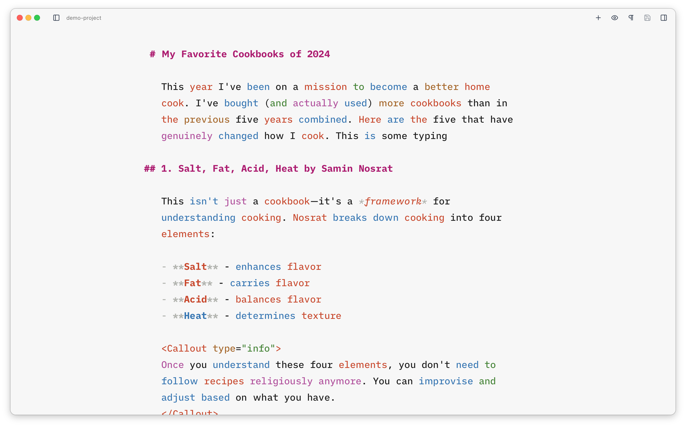

Where [Focus and Typewriter modes](/editor/focus-and-typewriter/) are designed to help with writing, the **copyedit** features help with editing and tweaking your work. They let you highlight the different parts of speech in your text, each in its own colour.

| Part of speech   | Colour | Why you might want it                          |
| ---------------- | ------ | ---------------------------------------------- |
| **Nouns**        | Red    | Identify the subjects and objects in your text |
| **Verbs**        | Blue   | Spot action words and check tense patterns     |
| **Adjectives**   | Brown  | Review how much descriptive language you use   |
| **Adverbs**      | Pink   | Catch potentially unnecessary modifiers        |
| **Conjunctions** | Green  | See how your sentences are connected           |

You can enable and disable these individually or all together via the [command palette](/reference/commands/).
