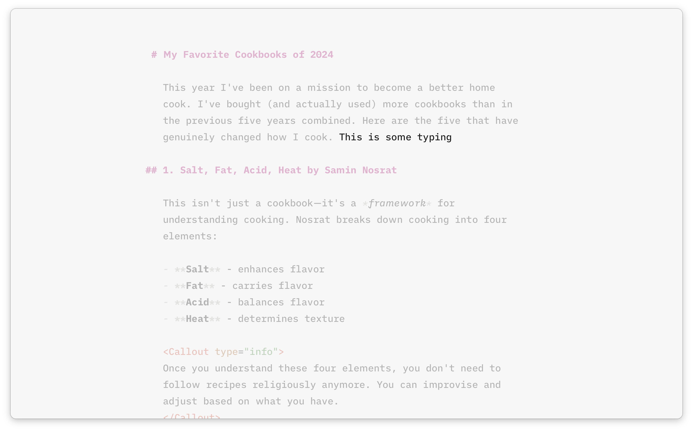
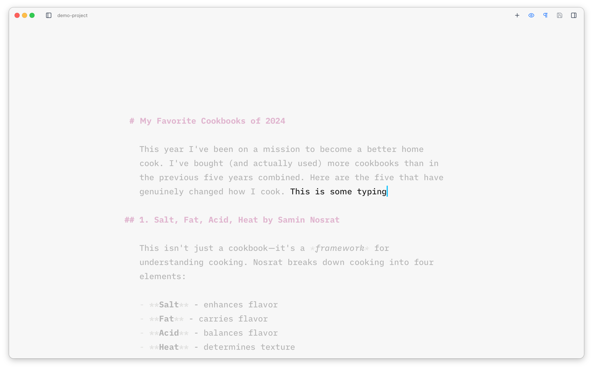

The Editor is already [designed](/editor/overview/) to provide a clean, distraction-free writing environment, but includes a couple of features to reduce distractions even further.

When both sidebars are closed, the toolbar at the top is hidden after a few keystrokes so the only thing visible is your content. You can bring it back by hovering your mouse near the top of the window.

## Focus Mode

Focus mode dims everything except the current sentence. It can be toggled on and off with <Kbd mac="Cmd+Shift+F" windows="Ctrl+Shift+F" /> or the *eye* icon in the toolbar. It's great for keeping your focus on **what you're writing right now**.

## Typewriter Mode

Typewriter mode keeps the cursor line vertically centered in the editor at all times. As you type or navigate, the viewport scrolls to keep the cursor in the middle of the visible area, much like a real typewriter.

You can toggle it on and off with <Kbd mac="Cmd+Shift+T" windows="Ctrl+Shift+T" /> or the icon in the toolbar.

