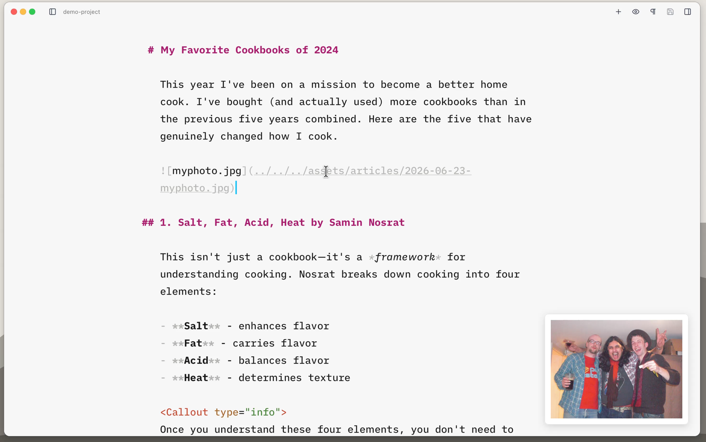

Images can be added by typing a markdown image tag, but you obviously need to know the URL or path to it. If you keep your images in `src/assets/` as Astro [recommends](https://docs.astro.build/en/guides/images/), adding something like a screenshot requires you to stop writing, rename the image to something sensible (and unique), move it into `src/assets/` and then add the image tag to your content file. All of which is super annoying.

## Dragging Images into Astro Editor

Astro Editor helps with this by allowing you to drag images and files into the editor. Dragging a file called `My Nice Photo (1).png` from somewhere like your desktop into a file in the editor will do the following:

<Steps>

1. **Copy it to your project**
  
   The file will be copied to wherever you keep your assets. By default, this is `src/assets/<collectionname>/`, but this can be configured in the [preferences](/preferences/#path-overrides).

2. **Rename it**
   
   The filename is downcased, spaces are replaced with dashes, and characters like brackets are stripped. The current date is prepended. This is done at the same time as Step 1, so we end up with `2026-06-23-my-nice-photo-1.png` in our assets directory.

   If a file of that name already exists, `-1` will be appended (or incremented if already present) to ensure uniqueness.

3. **Insert the markdown link**
   
   A markdown image tag will be inserted in your content file. For this example it would look something like this:

   ```markdown
   
   ```
</Steps>

Dragging other files (PDFs etc) works identically, except that a markdown **link** is inserted instead of an image tag.

<Aside>
By default, these images use paths relative to the current file, matching Astro's conventions. If you'd rather use absolute paths from the project root instead (e.g. `/src/assets/thing/image.png`), you can enable this in the [preferences](/preferences/#image-path-strategy-per-collection).
</Aside>

## Previewing images

When in the main editor, you can quickly preview images by holding <Kbd mac="Opt" windows="Alt" /> and hovering over any image path or URL. A preview will appear in the bottom right corner of the editor.



Relative paths like `./image.png` or `../images/photo.jpg` are resolved relative to the current file, while absolute paths like `/src/assets/article/image.png` are resolved relative to your project root.

<Aside>
Previews for relative paths work in most cases but can be unreliable in unusual folder structures.
</Aside>
