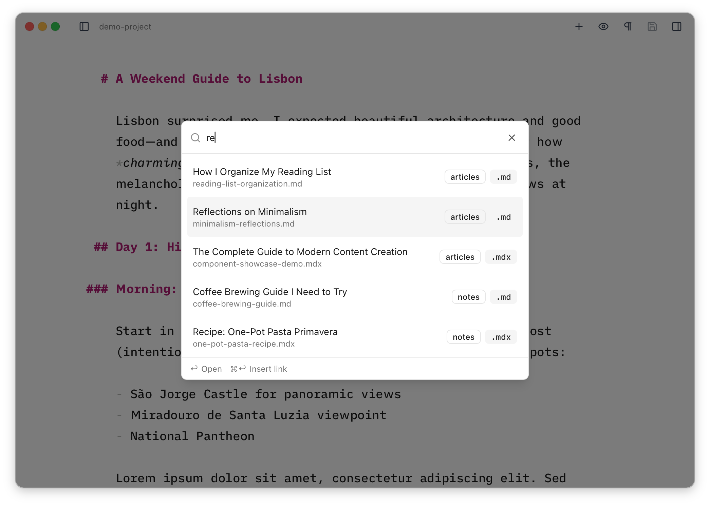

You can use <Kbd mac="Cmd+K" windows="Ctrl+K" /> to wrap selected text in an empty markdown link, and pasting a valid URL over selected text will wrap it in a link to that URL. Holding <Kbd mac="Opt" windows="Alt" /> while clicking a URL will open it in your browser.

## Internal Links

You can use the **Content Finder** to search across all the content items in your collections and insert a markdown link to it. This is especially handy when you're mid-flow and want to cross-reference another piece of content without leaving the editor.

You can open the Content Finder with <Kbd mac="Cmd+Shift+K" windows="Ctrl+Shift+K" />, or via the [Command Palette](/reference/commands/).



Because <Kbd mac="Enter" windows="Enter" /> opens the item for editing, you must use <Kbd mac="Cmd+Enter" windows="Ctrl+Enter" /> to insert a markdown link into the *current* document. The title will be used as the link text.

### Configuring a URL pattern

<Aside>
Checking the integrity and correctness of internal links is very much a **coder-mode** concern, so Astro Editor is just aiming to make it a little easier to add internal links quickly while you're writing. You should check your links properly before publishing.
</Aside>

By default, links inserted this way will use a relative path from the current file to the target file.

```markdown
[My Blog Post](../blog/my-blog-post.md)
```

This is often not what you want, so it's possible to configure the format used for these links in the preferences on a per-collection basis, by supplying a URL pattern. For example, if your blog collection serves posts at `/writing/mypost` you can set the URL pattern to `/writing/{slug}`, which will cause links to blog posts to look like this instead:

```markdown
[My Blog Post](/writing/my-blog-post)
```

The `{slug}` placeholder resolves to the content item's frontmatter `slug` field if one exists, or falls back to the item's ID (the filename without extension).
