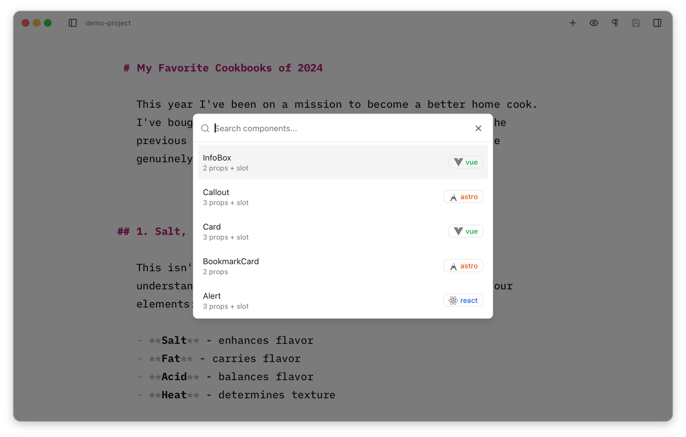
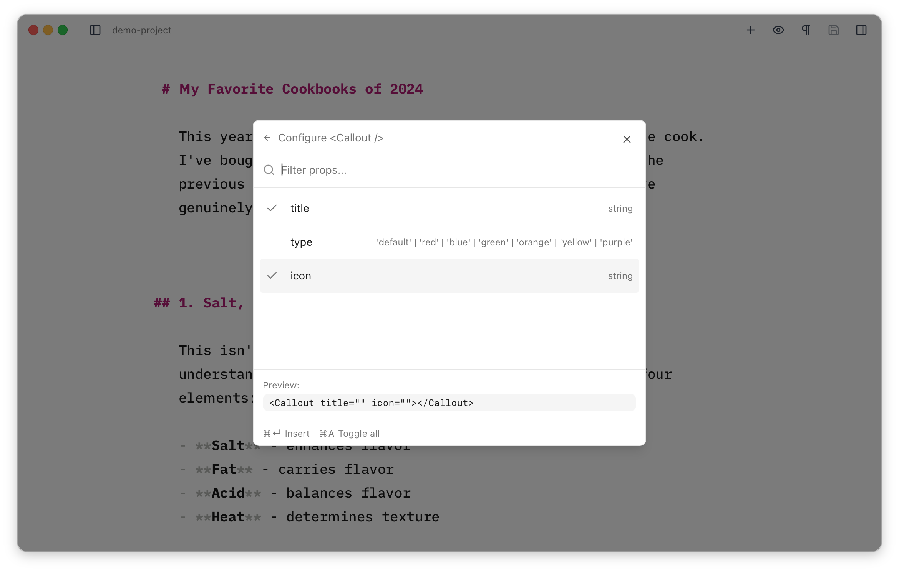
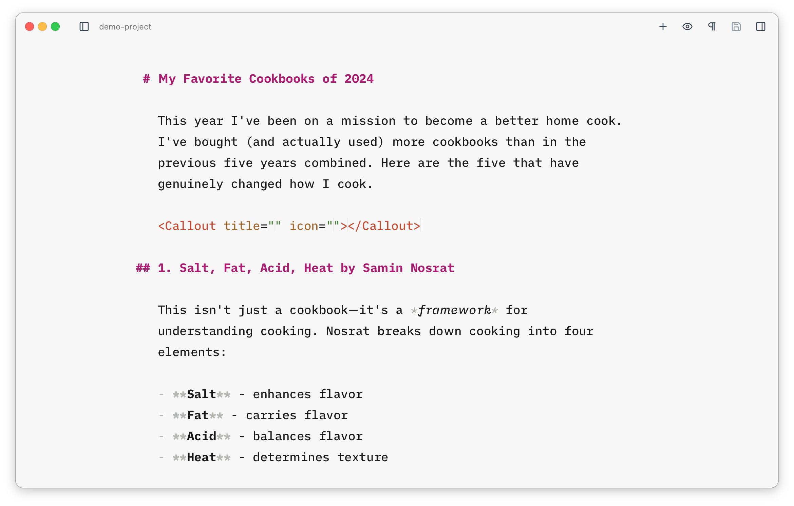

Many Astro sites contain components which are specifically designed for use in MDX content files. Here's a simple example.

```astro title="Highlight.astro"
<span class="highlight"><slot /></span>

<style>
  .highlight {
    background: var(--color-highlight-bg);
    padding: 0 8px 4px;
  }
</style>
```

Which we might use like this.

```mdx title="my-post.mdx"
This is some <Highlight>text I wanna highlight</Highlight>.
```

We can probably remember how to use a simple component like this, but using more complex components which accept multiple props can often mean opening a code editor and looking at the component file before we can use it.

## The MDX Component Builder

Astro Editor helps with using these kinds of components by providing an interface for searching and inserting them into MDX content files. When editing an MDX file, <Kbd mac="Cmd+/" windows="Ctrl+/" /> will open a palette showing all the components inside your configured *MDX directory*. You filter the results by typing, as you'd expect.



Each entry shows its framework as a coloured badge and a count of its props. If the component has a doc comment above it, a short description is pulled from it and shown under the name (and is searchable too).

Hitting <Kbd mac="Enter" windows="Enter" /> will open an interface showing the available props and their types along with a preview of what will be inserted.



Optional props can be toggled on or off and <Kbd mac="Cmd+Enter" windows="Ctrl+Enter" /> will insert the component into your document with your cursor in the first editable prop or slot. You can use <Kbd mac="Tab" windows="Tab" /> to move between them. When a prop only accepts a few set values, the first is pre-filled to get you started.



For components written in a framework (React, Vue, or Svelte), the configure step also lets you pick a [client directive](https://docs.astro.build/en/reference/directives-reference/#client-directives) — `client:load`, `client:idle`, `client:visible`, `client:media`, or `client:only`. This controls when (and whether) Astro hydrates the component in the browser, and gets added to the inserted tag. `client:idle` is recommended for most cases. Astro components don't need one, so the option only appears for framework components.

<Aside type="caution">
While Astro Editor will insert the component itself, it **won't add an import below the frontmatter**. While this is definitely coder-mode stuff, it's not great when in writer mode because, if you're running a dev server to preview as you write, the page will break until you switch to a code editor and add the missing import.

We may add this in a future release, but in the meantime, consider adding [Astro Auto Import](https://github.com/delucis/astro-auto-import) to your site and having it import all the components in your `mdx/` directory.
</Aside>

## What are "MDX" Components?

Any component meant to be used as above. By default, Astro Editor looks in `src/components/mdx/` and its subdirectories, but you can configure this in the [preferences](/preferences/#path-overrides). The component builder automatically detects which props and slots are available by reading the component's source code and works with well-formed components written in:

- **Astro** (`.astro` files)
- **React** (`.tsx`, `.jsx` files)
- **Vue** (`.vue` files)
- **Svelte** (`.svelte` files)
