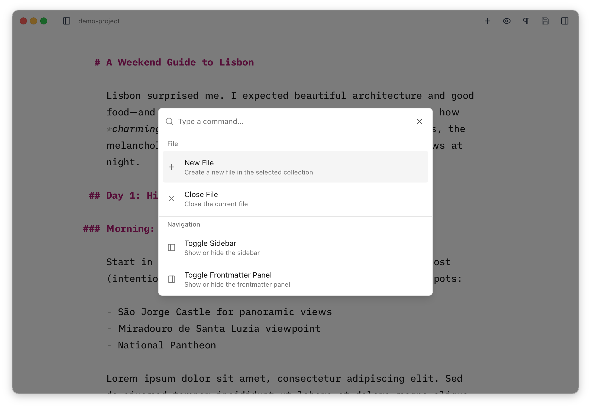

import { Aside } from '@astrojs/starlight/components'
import Figure from '../../../components/Figure.astro'
import editorLightFull from '../../../assets/editor-light-full.png'
import editorNarrow from '../../../assets/editor-narrow.png'
import editorDarkFull from '../../../assets/editor-dark-full.png'

The editor window shows the entire contents of your markdown or MDX files with the exception of the YAML [frontmatter](/frontmatter/overview/) and any JSX `import` lines immediately following the frontmatter. It's designed to provide an extremely clean writing interface, especially when both sidebars are closed. It provides markdown syntax highlighting and editing features.

## Typography

The editor might look simple at first glance, but a lot of thought has gone into its design and typography. It uses the wonderful [iA Writer Duo](https://ia.net/topics/in-search-of-the-perfect-writing-font/) variable font, which is better suited to prose than fully monospaced fonts, and the font size and line height adjust automatically to the size of the editor. The typography and colours also adjust appropriately for dark mode, and when there's enough room the leading `##` characters of headings "hang" in the margin.

<Figure src={editorLightFull} alt="The editor in light mode at a comfortable width, with the ## markers of a heading hanging in the left margin" caption="At a comfortable width, heading markers hang out in the margin." />

<Figure src={editorNarrow} alt="The editor in a narrow window, where the font size and line height have reduced to suit the smaller width" caption="Type size and line height adapt as the editor gets narrower." />

<Figure src={editorDarkFull} alt="The editor in dark mode, with typography and colours adjusted for a dark background" caption="Typography and colours adjust automatically for dark mode." />

<Aside>
You can customise the base font size and heading colour in [Preferences](/preferences/).
</Aside>

## Auto-Save

Astro Editor automatically saves your changes two seconds after you stop typing or when you hit `Cmd+S`. An additional save occurs after ten seconds of constant typing to make sure long thoughts don't end up lost if something goes wrong.

## The Command Palette

The command palette provides quick access to all major functions in Astro Editor and is especially useful when working in the editor pane. Press `Cmd+P` from anywhere in the application to open the command palette and start typing to search for a command. See the [Commands reference](/reference/commands/) for the full list of what's available.
