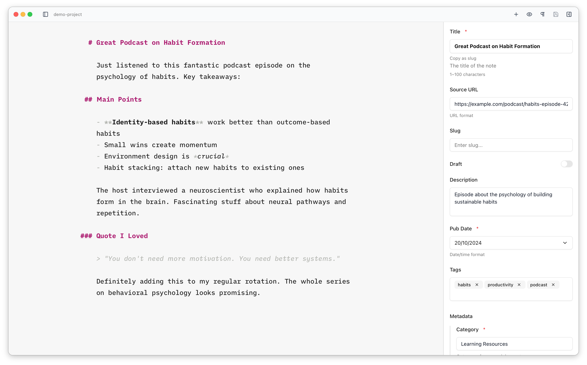

The frontmatter sidebar automatically generates a form based on your Astro content collection schema and the frontmatter present in the file. This means you get appropriate input types and a clean editing experience without any manual configuration.



## How Schema Parsing Works

To build the form, Astro Editor needs to understand your collection's schema. It reads that schema from two places and combines them.

### 1. The generated JSON schema

When Astro runs [`astro sync`](https://docs.astro.build/en/reference/cli-reference/#astro-sync) — which also happens automatically when you run `astro dev` or `astro build` — it writes a JSON Schema file for each collection into `.astro/collections/`, for example `.astro/collections/blog.schema.json`. This is Astro Editor's main source of truth, and it describes almost everything the form needs:

- field types (string, number, boolean, date, array, object, enum)
- constraints (min/max, minimum/maximum length, regex patterns)
- descriptions (from `.describe()`)
- default values, and which fields are required
- nested objects, flattened into dotted paths like `coverImage.image`

Astro Editor watches this folder, so whenever these files are regenerated the form updates automatically.

<Aside type="tip">
If a field isn't appearing, or its type or validation looks wrong, the usual fix is to run `astro sync` (or just start your dev server) to regenerate these files. Astro Editor will pick up the changes on its own.
</Aside>

### 2. Your Zod schema (for Astro-specific helpers)

A JSON schema can't describe two of Astro's helpers, so Astro Editor *also* reads your Zod schema directly — from `src/content.config.ts` or `src/content/config.ts` — purely to find them:

- `image()` — shown as an image picker
- `reference('collection')` — shown as a dropdown that links to another collection

Take a schema like this:

```ts title="src/content.config.ts"
const blog = defineCollection({
  schema: ({ image }) =>
    z.object({
      title: z.string().max(100), // type and 100-char limit come from the JSON schema
      draft: z.boolean().default(false), // type and default come from the JSON schema
      cover: image(), // recognised by reading this file
      author: reference('authors'), // recognised by reading this file
    }),
})
```

Here, `title` and `draft` (and their types, limits, and defaults) come from the generated JSON schema, while `cover` and `author` are recognised as an image picker and a reference dropdown by reading the config file itself. See [Field Types](/frontmatter/field-types/) for how each type maps to a control.

### When there's no JSON schema

If the generated JSON schema is missing or can't be read, Astro Editor falls back to reading your Zod schema on its own and inferring the fields from it. This handles most everyday schemas, but it's more limited than the JSON schema: it can miss or misread fields in schemas that are complex, built dynamically, spread in from other objects, or imported from a third-party package (Starlight's schemas, for instance). Running `astro sync` resolves nearly all of these, because it produces the complete JSON schema for Astro Editor to read.

If neither source is available, no schema-driven form is generated and you'll simply see the file's existing frontmatter fields.

## Field Order and Defaults

Fields appear in the sidebar in the order they're defined in your schema, except the title field, which is always shown first. When you create a new file, any default values from your schema are pre-filled in the panel.

The frontmatter is written to your file in the same order it's defined in the schema, with any fields that aren't in the schema written after them, in alphabetical order by field name.

## Fields not in your schema

Frontmatter fields that aren't part of the schema are never discarded. They're still shown in the sidebar — below the schema fields and sorted alphabetically — and they're kept when you save. Because there's no schema to describe them, they're shown as plain text inputs (a list of text values becomes a tag field), rather than as typed controls like date pickers or toggles.
