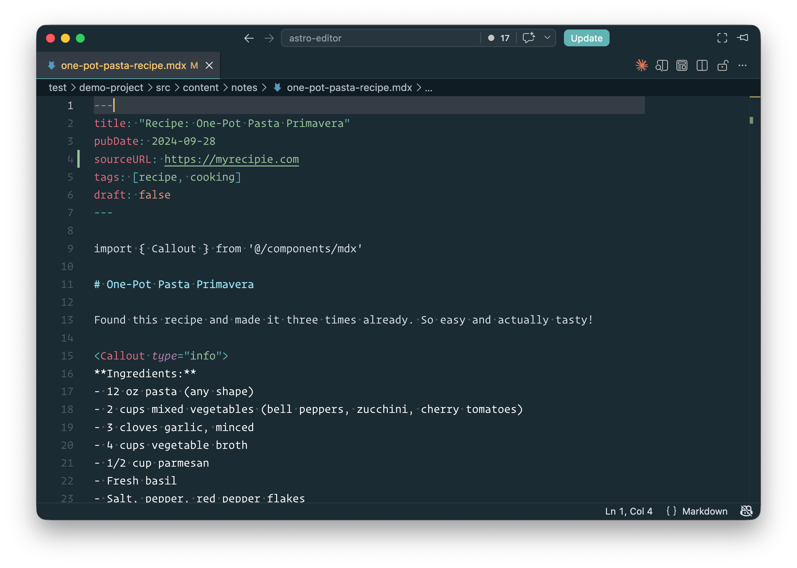
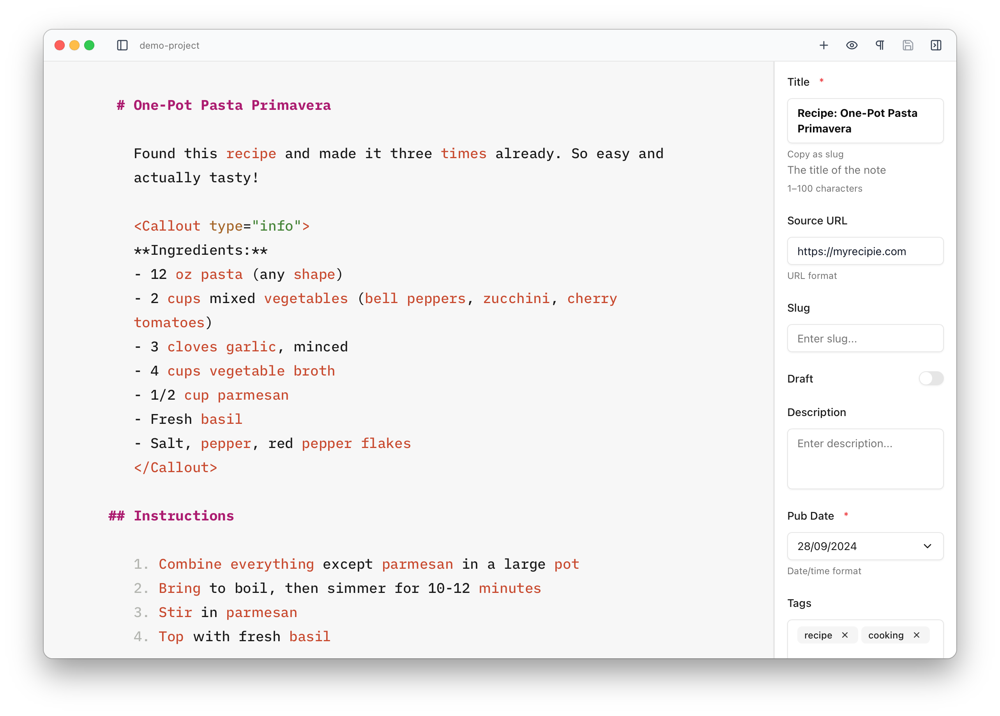
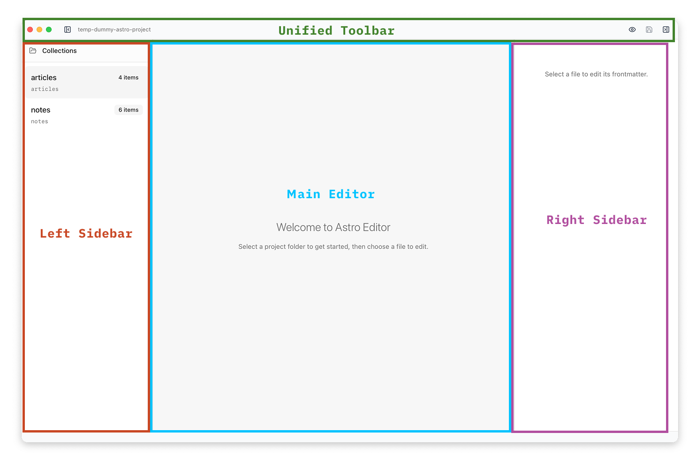
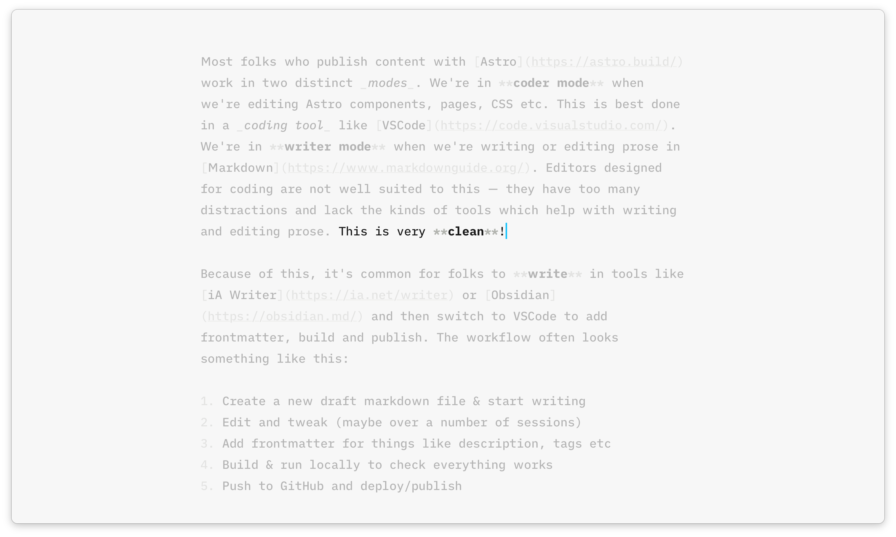

import { FileTree, Aside } from '@astrojs/starlight/components';

Astro Editor is an interface for the content in your [Astro](https://astro.build/) project — the [philosophy page](/getting-started/philosophy/) explains why that matters. To see how it fits together in practice, it helps to look at an example.

Let's imagine we have an Astro site with two content collections: **articles** and **notes**, defined in `content.config.ts` like this:

```ts
const articles = defineCollection({
  loader: glob({ pattern: '**/[^_]*.{md,mdx}', base: './src/content/articles' }),
  schema: ({ image }) =>
    z.object({
      title: z.string(),
      slug: z.string().optional(),
      draft: z.boolean().default(false),
      description: z.string().optional(),
      pubDate: z.coerce.date(),
      cover: image().optional(),
    }),
});

const notes = defineCollection({
  loader: glob({ pattern: '**/[^_]*.{md,mdx}', base: './src/content/notes' }),
  schema: () =>
    z.object({
      title: z.string(),
      sourceURL: z.string().optional(),
      slug: z.string().optional(),
      pubDate: z.coerce.date(),
      draft: z.boolean().default(false),
      description: z.string().optional(),
      tags: z.array(z.string()).optional(),
    }),
});
```

We can expect a note to look something like this in [VSCode](https://code.visualstudio.com/)...



This is not a pleasant interface for writing content.

1. VSCode isn't meant for content editing: we have all sorts of distracting UI plus a load of non-content files in the sidebar.
2. The frontmatter is a distraction when writing, and we have to remember the name and types of any fields we want to add.
3. The first line in the content is an `import` for an Astro component we're using further down.

This same file is shown like this in Astro Editor...



1. The content is centre-stage and we can only see actual items in our content collections.
2. The frontmatter and `import`s are hidden.
3. The frontmatter is instead shown in the right sidebar, and even though there's no `slug` or `description` in the file's frontmatter there are empty fields for them in the sidebar because Astro Editor has read the schema and knows those fields are available for notes.

## Astro Project Structure

By default, Astro Editor expects your project to look something like this:

<FileTree>
- my-astro-site
  - src
    - assets
      - articles Assets for use in articles
        - image1.png
      - notes Assets for use in notes
        - attachment2.pdf
        - image2.png
    - content
      - articles Articles content collection
        - first-article.md
        - second-article.mdx
        - third-article.md
      - notes Notes content collection
        - note-one.mdx
        - note-two.md
    - components
      - mdx Components intended for use in MDX files
        - Callout.astro
    - content.config.ts
</FileTree>

- The schema in `content.config.ts` provides information on the content collections and their frontmatter fields.
- The `content/<collection>/` directories are where we look for the actual content files of each collection.
- The `assets/<collection>/` directories are where we add images and files dragged into the editor, or uploaded to [*image* frontmatter fields](/frontmatter/field-types/#image-fields).
- The `components/mdx/` directory contains components like `Callout.astro`, which can be easily inserted into content using the [MDX component builder](/editor/mdx-components/).

<Aside type="tip">
The paths for these directories are configurable per project and per collection in [Preferences](/preferences/).
</Aside>

## The Interface

Astro Editor uses a simple three-panel layout.



| Interface Area    | Purpose                                                                      |
| ----------------- | ---------------------------------------------------------------------------- |
| **[Left Sidebar](/file-management/overview/)**  | Browse, sort and filter collections and files |
| **[Main Editor](/editor/overview/)**   | The main editor window                        |
| **[Right Sidebar](/frontmatter/overview/)** | Frontmatter editor       |
| **Toolbar**       | Minimal UI controls                              |

With both sidebars hidden and [Focus Mode](/editor/focus-and-typewriter/#focus-mode) switched on, we get an extremely clean interface for working with our content.



## Astro Site Requirements

Astro Editor will only work properly with Astro projects which:

- Are using Astro 5+ _(it might work with Astro 4+ but you should expect a few bugs)_
- Use Astro [Content Collections](https://docs.astro.build/en/guides/content-collections/) and have a `src/content/config.ts` or `src/content.config.ts` file with at least one collection defined using `defineCollection`. It **must** use the `glob` loader and have a `schema`.
- Have all collections within a single directory: `src/content/[collectionname]/`

<Aside>
Content collections can contain non-markdown/MDX files, but they will not be shown in the editor.

Some features require you to have certain properties in your schema: a date field is required for proper ordering in the file list; a boolean field is required to show and filter drafts; a text field is required to show titles in the sidebar.
</Aside>
