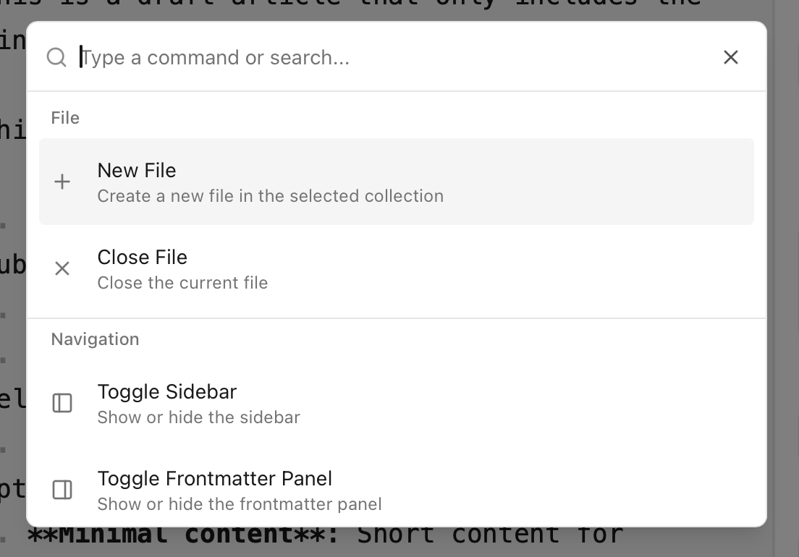

The command palette provides quick access to all major functions in Astro Editor. It's designed for keyboard-driven workflows and fast file switching.

**Opening the Palette**: Press <Kbd mac="Command+K" /> from anywhere in the application to open the command palette. Start typing immediately to search.

**Fuzzy Search**: The palette uses intelligent fuzzy matching, so you can type partial words or abbreviations. For example, typing "foc" will find "Toggle Focus Mode".

## Command Categories

Commands are organized into logical groups that appear at the top of the search results:

**File Operations**

- **New File**: Create a new file in the current collection
- **Save File**: Save the currently open file
- **Close File**: Close the current file

**Navigation**

- **Open Collection**: Jump to a different content collection
- **Toggle Sidebar**: Show/hide the left file browser
- **Toggle Frontmatter Panel**: Show/hide the right frontmatter editor

**Project Management**

- **Open Project**: Select and open a different Astro project
- **Reload Collections**: Refresh the project's content collections
- **Open in IDE**: Open the current project, collection, or file in your configured IDE.

## File Search

The command palette doubles as a powerful file search tool. When you type text that doesn't match a command, it automatically searches across all files in your project:

**Cross-Collection Search**: Finds files in any collection, not just the currently selected one.

**Title and Filename Matching**: Searches both the frontmatter title and the actual filename.

**Quick Switching**: Select any file from the search results to open it immediately, even if it's in a different collection.

## Opening in Your IDE

The "Open in IDE" command launches your preferred code editor with either the current file or the entire project. Configure your IDE command in preferences (<Kbd mac="Command+," />). Popular options include:

- `code` for Visual Studio Code
- `cursor` for Cursor
- `subl` for Sublime Text
