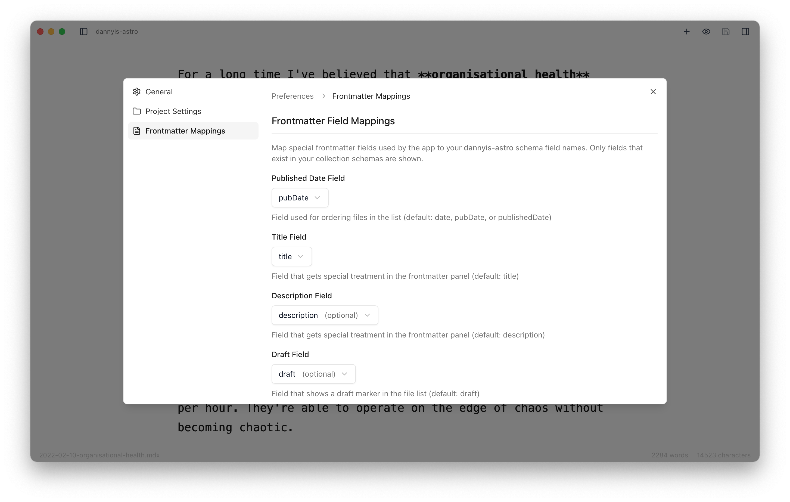

Astro Editor provides both global preferences and project-specific settings to accommodate different workflows and project structures.

## General Preferences

Access global preferences through <Kbd mac="Command+," /> or the application menu. These settings apply across all projects:

**Theme**: Choose between light mode, dark mode, or system theme (follows macOS setting).

**IDE Command**: Configure the command used for "Open in IDE" functionality. Common values:

- `code` for Visual Studio Code
- `cursor` for Cursor
- `subl` for Sublime Text
- Custom paths like `/Applications/Nova.app/Contents/MacOS/Nova`

**Default Project Settings**: Set the defaults that will be applied to newly opened projects.

## Project Settings

Each project can override global settings to accommodate different structures or workflows. Access project settings through the preferences panel.

**Path Overrides**: Customize directory locations if your project uses non-standard paths:

- **Content Directory**: Default is `src/content/`, but you might use `content/` or `docs/`
- **Assets Directory**: Default is `src/assets/`, useful for projects using `public/images/` or `static/`
- **MDX Components Directory**: Default is `src/components/mdx/` (reserved for future features)

**Frontmatter Field Mappings**: Configure which frontmatter fields are used for specific purposes:

- **Title Field**: Default `title`, controls file display names and special styling
- **Date Field**: Default `["pubDate", "date", "publishedDate"]`, used for file sorting
- **Description Field**: Default `description`, gets enhanced textarea styling
- **Draft Field**: Default `draft`, controls draft detection and filtering

## Settings Storage

Settings are automatically saved to your system:

- **Location**: `~/Library/Application Support/is.danny.astroeditor/`
- **Global Settings**: Shared across all projects
- **Project Registry**: Remembers all opened projects and their individual settings
- **Auto-Recovery**: Settings persist across app restarts and crashes

Projects are identified by their `package.json` name and automatically migrate if you move the project folder.

_[Screenshot needed: Preferences window showing global and project-specific settings]_
