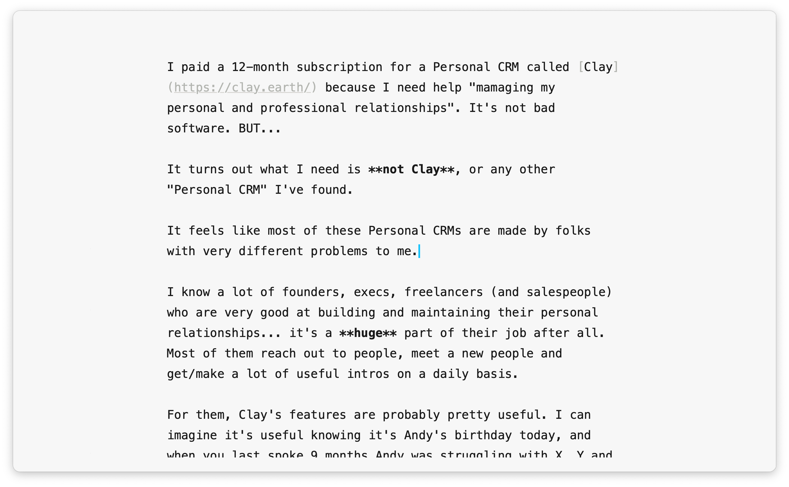
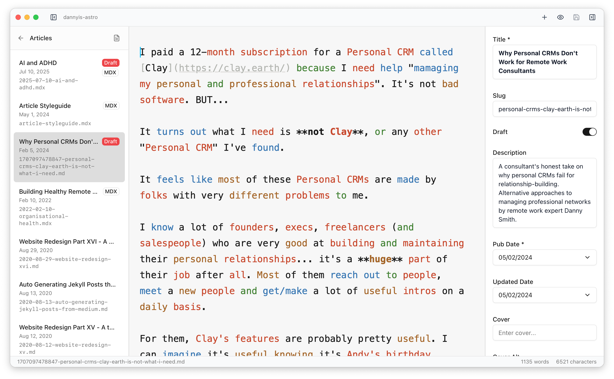
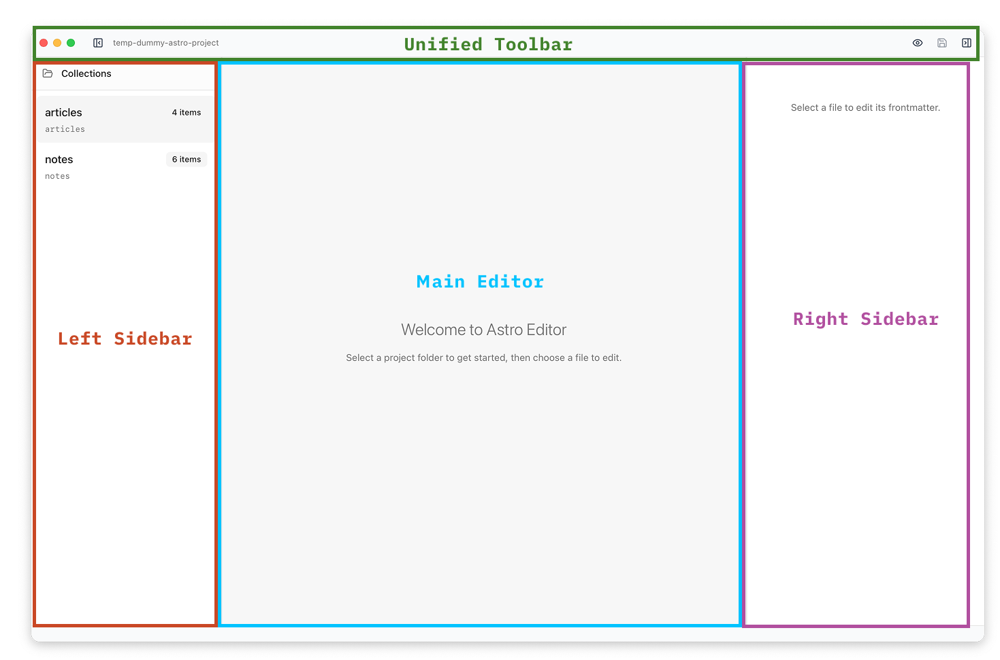
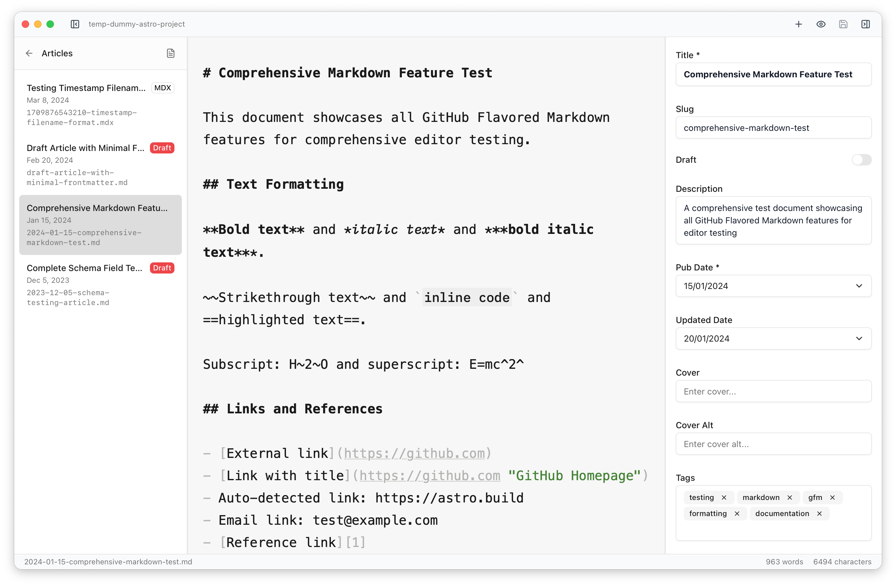

import { FileTree } from '@astrojs/starlight/components'

Astro Editor provides a clean, pleasant user experience for authoring and editing [Markdown](https://www.markdownguide.org/) & [MDX](https://mdxjs.com/) files in the content collections of local [Astro](https://astro.build/) sites.

## Philosophy

Most folks who publish content with Astro work in two distinct _modes_. We're in **coder mode** when we're editing Astro components, pages, CSS etc. This is best done in a _coding tool_ like VSCode. Whe're in **writer mode** when we're writing or editing prose in markdown. Editors designed for coding are not well suited to this - they have too many distractions and lack the kinds of tools which help with writing and editing prose.

Because of this, it's common for folks to **write** in tools like iA Writer or Obsidian and then switch to VSCode to add frontmatter, build and publish. The workflow often looks something like this:

1. Create a new draft markdown file & start writing
2. Edit and tweak (maybe over a number of sessions)
3. Add frontmatter for things like description, tags etc
4. Build & run locally to check everything works
5. Push to github and deploy/publish

Steps 1-3 are very much _writer mode_ tasks, while 4 & 5 are definitely _coder mode_ tasks. Astro Editor is only concerned with the former, which means:

- Code blocks are not syntax highlighted. If you have code examples in your files you're better off authoring them in a coding tool which can properly lint, format and check your code examples.
- There's no mechanism for committing or publishing in Astro Editor. You should do that in a code editor or terminal.
- There's no way to preview your writing. The best way to do that is by running your astro site locally with `npm run dev` and looking at it there.

Because the goal of this **simplicity when in writer mode**, Astro Editor is intentionally opinionated about its UI and limits the user customisation features to _"making it work with your Astro project and no more"_. It's not possible to customise the colour schemes, typeface etc. If you need fine-grained customization & extensibility we recommend using a custom profile in VSCode (or Obsidian) which you've set up for Markdown editing.

## Astro Requirements

Astro Editor will only work properly with Astro projects which:

- Are using Astro 5+ _(it might work with Astro 4+ but you should expect a few bugs)_
- Use Astro [Content Collections](https://docs.astro.build/en/guides/content-collections/) and have a `src/content/config.ts` file.
- Have at least one collection defined with `defineCollection`. It **must** use the `glob` loader and have a `schema`.
- Have all collections in a single directory: `src/content/[collectionname]`

Content collections can contain non-markdown/MDX files, but they will not be shown in the editor.

Some features require you to have certain properties in your schema. A date field is required for proper ordering in the file list. A boolean field is required to show and filter drafts. A text field is required to show titles in the sidebar. Etc.

By default, Astro Editor expects the following structure in your Astro project:

<FileTree>

- my-astro-site
  - src
    - assets
      - mycollection
        - image1.png
    - content
      - mycollection
        - blog-post.mdx
    - components
      - mdx
        - ExampleAstroComponent.astro
    - content.config.ts

</FileTree>

The paths to the _Assets_, _Content_, and _MDX Components_ directories (relative to the project root) are configurable per project, but their internal structures are not.

## Directory Restrictions

For security reasons, Astro Editor cannot open projects located in certain system directories. If you attempt to open a project in one of these locations, you'll see an error message asking you to choose a different location.

**Restricted directories:**

- `/System/` - macOS system files
- `/usr/` - Unix system resources
- `/etc/` - System configuration files
- `/bin/` and `/sbin/` - System binaries
- `/Library/Frameworks/` and `/Library/Extensions/` - System frameworks
- `~/Library/Keychains/` - Keychain data
- `~/.ssh/` - SSH keys and configuration
- `~/.aws/` - AWS credentials
- `~/.docker/` - Docker configuration

These restrictions help protect sensitive system files while still allowing you to open Astro projects stored in typical development locations like `~/Documents/`, `~/Desktop/`, `~/Projects/`, or anywhere else outside the restricted areas.

## Quick Start

Getting started with Astro Editor takes just a few steps. The application is designed to work with existing Astro projects that use content collections.

1. **Open an Astro Project**: Use `File > Open Project` to select your Astro project directory. Astro Editor will automatically scan for content collections defined in your `src/content/config.ts` file.

2. **Select a Collection**: Once your project opens, you'll see your content collections listed in the left sidebar. Click on any collection name to view the files it contains.

3. **Open a File**: Click on any markdown or MDX file in the file list to open it in the main editor. The editor will show your content without the frontmatter, which appears in the right sidebar.

4. **Start Writing**: Begin editing. Your changes are automatically saved every 2 seconds, and you can manually save anytime with <Kbd mac="Command+S" />.

5. **Edit Frontmatter**: Use the right sidebar to edit metadata fields. These forms are automatically generated from your Astro content collection schemas.

That's it. Astro Editor handles project discovery, file management, and frontmatter editing automatically based on your existing Astro setup.

## Interface Overview

Astro Editor uses a clean three-panel layout designed to minimize distractions while providing easy access to files and metadata:

| Interface Area    | Purpose                                                                      |
| ----------------- | ---------------------------------------------------------------------------- |
| **Left Sidebar**  | Browse collections and files, with draft indicators and context menu options |
| **Main Editor**   | Clean writing space with markdown syntax highlighting                        |
| **Right Sidebar** | Dynamic frontmatter forms generated from your Astro collection schemas       |
| **Top Bar**       | Project name, window controls, and menu access                               |
| **Status Bar**    | Shows current file, save status, and word count                              |

Both sidebars can be hidden using <Kbd mac="Command+1" /> (left) and <Kbd mac="Command+2" /> (right) for distraction-free writing. The panels remember their sizes and visibility between sessions.

