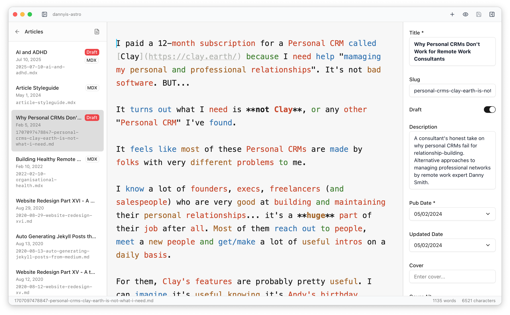

<div class="dot-pattern" aria-hidden="true"></div>

import { CardGrid, Card } from '@astrojs/starlight/components'
import { Kbd } from 'starlight-kbd/components'

## See it in action

Schema-aware frontmatter forms meet distraction-free writing. Your content collections, beautifully organized.


<CardGrid stagger>
  <Card title="File Sidebar" icon="bars">
    Collections & drafts organized by date.
  </Card>
  <Card title="Clean Editor" icon="seti:image">
    Markdown without the YAML clutter.
  </Card>
  <Card title="Smart Forms" icon="rocket">
    Auto-generated from your Zod schemas.
  </Card>
</CardGrid>

> Most Astro developers work in two modes:  
> **coder mode** (components, deployment) and **writer mode** (content).  
> Astro Editor focuses purely on writer mode — no git, no preview, no deployment.  
> Just distraction-free writing with intelligent forms that understand your schemas.

## Writing modes

### Focus mode

Eliminate distractions with focus mode. Only your current sentence stays bright while everything else fades away.

Perfect for deep writing sessions when you need to concentrate on one thought at a time.


### Copyedit highlighting

Analyze your writing with color-coded parts of speech. Spot overused adverbs, check verb consistency, and improve your prose.

Toggle individual highlights for nouns, verbs, adjectives, adverbs, and conjunctions.



### MDX component insertion

Press <Kbd mac="Command+/" /> in MDX files to instantly insert Astro components. Configure props visually, then tab through to fill values.

Reads your component props automatically from your project's MDX component directory.


### Beautiful dark interface

Inspired by iA Writer's clean aesthetics. Custom syntax highlighting makes your markdown beautiful without overwhelming your content.

Light and dark themes with thoughtful typography designed for long writing sessions.


## Features

Everything you need to edit Astro content. Thoughtful details for teams and solo creators — designed to keep you in flow.

<CardGrid stagger>
  <Card title="Schema-aware frontmatter" icon="rocket">
    Reads your Zod schemas from `content.config.ts`. Dates become date pickers,
    enums become dropdowns, arrays become tag inputs.
  </Card>
  <Card title="Smart image handling" icon="seti:image">
    Drag images into the editor — automatically copied to your assets folder
    with web-safe names and proper markdown links.
  </Card>
  <Card title="Writer mode, not coder mode" icon="pencil">
    Focus mode dims everything but your current sentence. Typewriter mode keeps
    your cursor centered.
  </Card>
  <Card title="Command palette" icon="star">
    Press Cmd+K for instant access. Fuzzy search files, execute commands, switch
    projects — all keyboard-driven.
  </Card>
  <Card title="MDX component insertion" icon="puzzle">
    Press Cmd+/ in MDX files to insert Astro components. Configure props
    visually, then tab through to fill values.
  </Card>
  <Card title="Auto-save & crash recovery" icon="download">
    Saves every 2 seconds while you write. Full crash recovery means you never
    lose work, even if the app quits unexpectedly.
  </Card>
</CardGrid>

## How it works

1. **Open your Astro project**  
   Point to any Astro 5+ project with content collections. Schemas are read from `content.config.ts`.

2. **Write without friction**  
   Frontmatter fields become smart forms. YAML stays hidden. Focus purely on your content.

3. **Stay in your workflow**  
   Use your IDE for code, terminal for git. Astro Editor handles the writing. Each tool does what it does best.

```ts
import { defineCollection, z } from 'astro:content'

// Your schemas define the editing experience. No configuration needed.
const posts = defineCollection({
  type: 'content',
  schema: z.object({
    title: z.string(),
    featured: z.boolean().default(false),
    date: z.date(),
    tags: z.array(z.string()).default([]),
    description: z.string().optional(),
  }),
})

export const collections = { posts }
```
