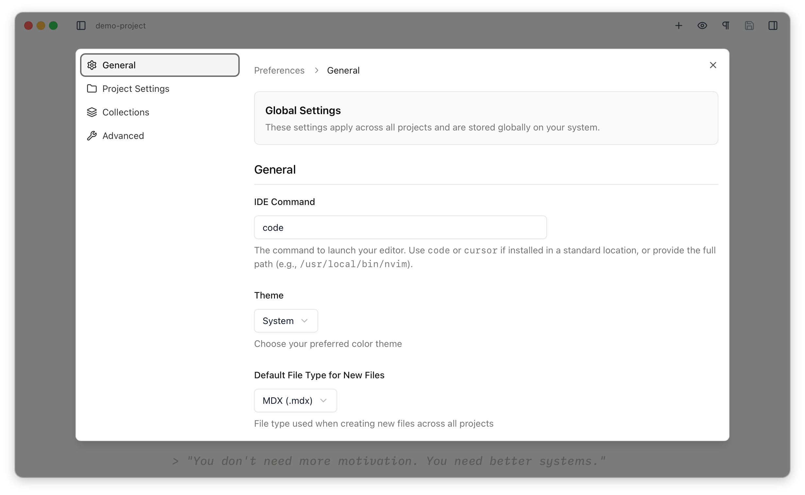
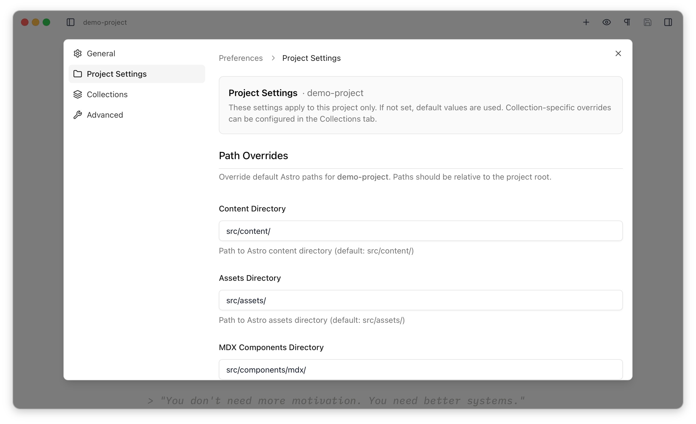
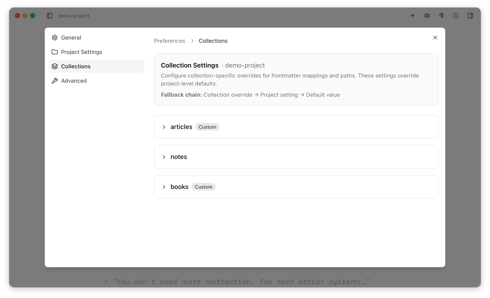

The preferences can be opened with <Kbd mac="Cmd+," windows="Ctrl+," /> or via the app menu. The **General** and **Advanced** panes are always available, while the **Project Settings** and **Collections** panes appear only when a project is open.

## General

Global preferences that apply to every project.

**IDE Command** — the command used to launch your editor for "Open in IDE" (for example `code`, `cursor`, or a full path like `/usr/local/bin/nvim`). See [IDE Integration](/file-management/ide-integration/).

**Theme** — Light, Dark, or System (System follows your operating system).

**Default File Type for New Files** — whether new files are created as Markdown (`.md`) or MDX (`.mdx`). Can be overridden per project and per collection — see [Overrides](/reference/overrides/).

### Appearance

**Heading Color (Light Mode)** / **Heading Color (Dark Mode)** — the colour of markdown headings in the editor, set separately for each theme, each with a Reset button. See [the editor overview](/editor/overview/).

**Editor Font Size** — the base font size for editor text, in pixels (default 18). The rest of the editor's typography scales from this.

### Editor

**Auto Save Delay** — how long after you stop typing before changes are written to disk: 1, 2, 5, or 10 seconds (default 2). See [Auto-save](/editor/overview/#auto-save).

## Project Settings

Settings for the whole of the currently-open project. Where a setting isn't set here, Astro Editor's built-in default is used. Per-collection overrides live in the **Collections** tab.

### Path Overrides

Point Astro Editor at non-standard directories. [Overrides](/reference/overrides/) lists the defaults and scope for each.

**Content Directory** — where your content collections live (default `src/content`).

**Assets Directory** — where dragged or inserted images are copied (default `src/assets`).

**MDX Components Directory** — where the [component builder](/editor/mdx-components/) looks for components (default `src/components/mdx`). This one has no per-collection override.

**Use Absolute Paths for Images** — off by default, so inserted image paths are relative to the current file. See [Images & Files](/editor/images-and-files/).

### File Defaults

**Default File Type for New Files** — override the global default for this project, or inherit it.

## Collections

Per-collection overrides, for when collections within a project have different structures or conventions. Pick a collection, then set any of the settings below. Each one falls back to the project setting, then the built-in default — the [three-tier fallback](/reference/overrides/).

### Path Overrides

**Content Directory** and **Assets Directory** — override the project's paths for this one collection. (There's no per-collection MDX components directory.)

**Use Absolute Paths for Images** — override the project's image-path setting for this collection.

### File Defaults

**Default File Type for New Files** — override the project or global default for this collection.

### Frontmatter Mappings

Tell Astro Editor which frontmatter field to treat as each [special field](/frontmatter/special-fields/) in this collection. These mappings are only configurable per collection.

**Published Date Field** — the date field used to order the file list (must be a date field).

**Title Field** — the field shown as the title and given the special panel treatment (must be a string).

**Description Field** — the field rendered as a tall, multi-line text area (must be a string).

**Draft Field** — the boolean field that drives the draft badge and filter.

### Content Links

**Link URL Pattern** — a template for links the [Content Finder](/editor/links/#internal-links) inserts, using `{slug}` (for example `/blog/{slug}`). When left empty, links use a relative file path instead. See [Overrides](/reference/overrides/).

## Advanced

Diagnostics and maintenance rather than day-to-day settings. The tab shows the application and preferences versions, and offers two actions:

- **Open Preferences Folder** — reveal where your settings are stored on disk (see [Advanced Preferences](/reference/advanced-preferences/)).
- **Reset All Preferences** — delete every stored setting and restart the app. This is destructive and can't be undone, but it's useful if your settings ever become corrupted. See [Troubleshooting](/reference/troubleshooting/).
