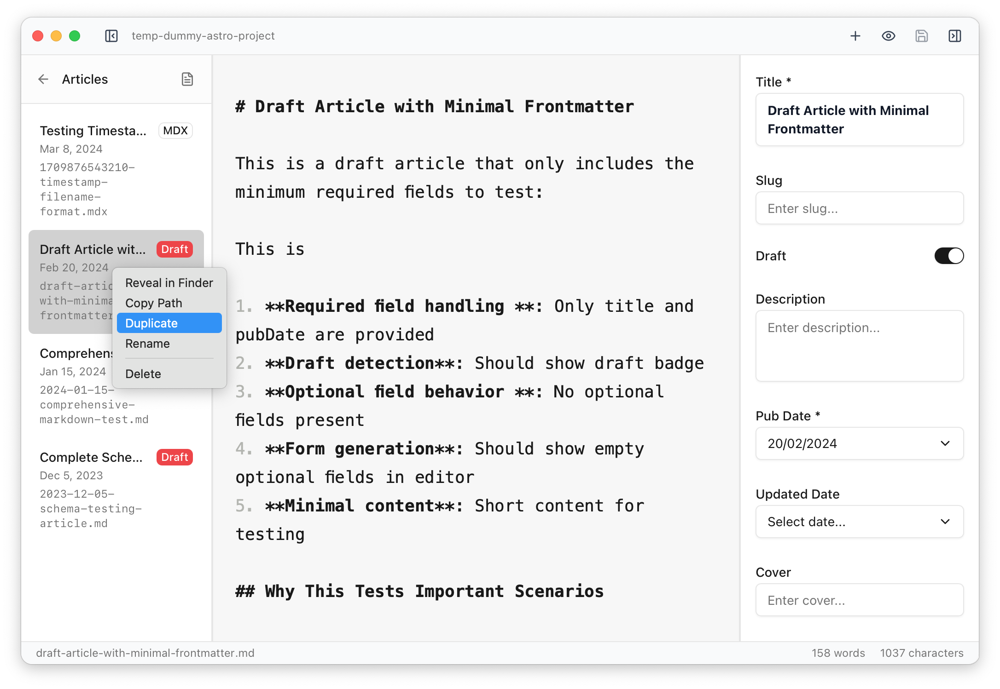

The left sidebar provides your primary interface for navigating between files and collections in your Astro project.

## Collections and File Organization

**Collection Selection**: Click on any collection name to view its files. The currently selected collection is highlighted, and its files appear below.

**File Ordering**: Files are automatically sorted by their publication date (newest first), using the date field configured in your project settings (defaults to `pubDate`, `date`, or `publishedDate`). Files without dates appear at the top of the list.

**File Display**: Each file shows:

- **Title**: Taken from the `title` frontmatter field, or the filename if no title exists
- **Date**: Publication date in a readable format (e.g., "Dec 15, 2023")
- **Draft Badge**: Yellow "Draft" indicator for files marked as drafts

## Draft Management

**Draft Detection**: Files are automatically detected as drafts when their `draft` frontmatter field (or configured equivalent) is set to `true`.

**Draft Filtering**: Use the "Show Drafts Only" toggle in the toolbar to filter the file list to show only draft files. This is useful when reviewing unpublished content.

## File Operations

**Opening Files**: Click any file to open it in the main editor. The currently open file is highlighted with a border.

**Context Menu**: Right-click any file to access additional operations:

- **Rename**: Edit the filename inline without changing file content
- **Duplicate**: Create a copy of the file with a new name
- **Reveal in Finder**: Open the file's location in the Finder
- **Copy Path**: Copies the file's absolute path to the clipboard

**Creating New Files**: Use `Cmd+N` or the "New File" button to create a new file in the currently selected collection. You'll be prompted to enter a filename, and the file will be created with default frontmatter from your collection schema.

