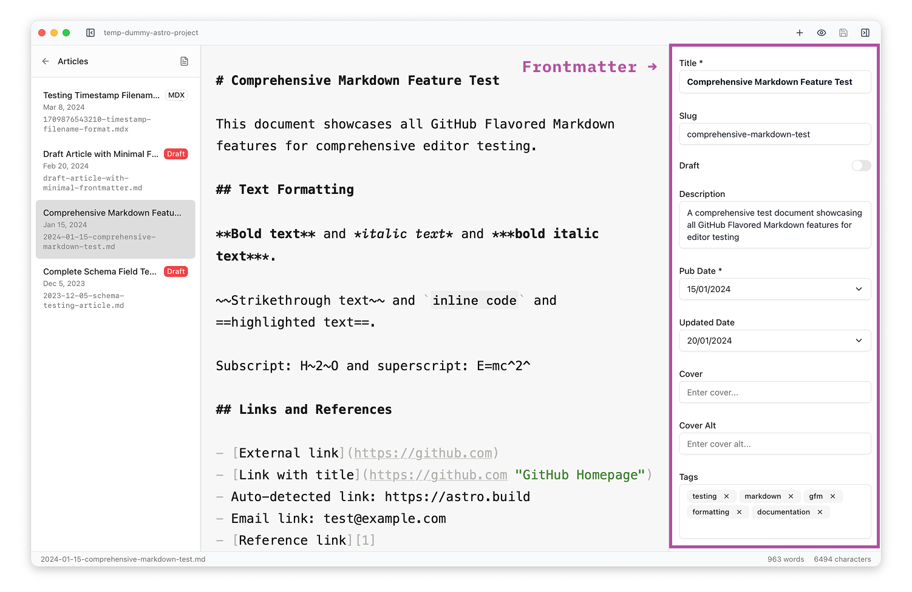

The frontmatter sidebar automatically generates editing forms based on your Astro content collection schemas. This means you get proper validation, appropriate input types, and a clean editing experience without any manual configuration.

## How Schema Fields Become Forms

Astro Editor reads your `src/content/config.ts` file and converts Zod schema definitions into appropriate form controls. The mapping works as follows:

| Zod Schema Type           | Form Control      | Behavior                           |
| ------------------------- | ----------------- | ---------------------------------- |
| `z.string()`              | Single-line input | Standard text input                |
| `z.string().optional()`   | Single-line input | Empty field allowed, no validation |
| `z.enum(['a', 'b', 'c'])` | Dropdown select   | Shows all enum options             |
| `z.boolean()`             | Toggle switch     | True/false with visual switch      |
| `z.date()`                | Date picker       | Native date selection widget       |
| `z.number()`              | Number input      | Numeric validation and steppers    |
| `z.array(z.string())`     | Tag input         | Add/remove tags with keyboard      |

## Special Field Handling

**Title Fields**: If your schema has a field named `title` (or configured in project settings), it renders as a larger, bold textarea that automatically expands as you type. Title fields always appear first in the panel, regardless of their position in the schema.

**Description Fields**: Fields named `description` get a multi-line textarea that grows based on content length.

**Required Fields**: Required schema fields show an asterisk (\*) next to their label and prevent saving if empty.

## Field Order and Defaults

Fields appear in the sidebar in the same order they're defined in your Zod schema. When you create a new file, any default values specified in your schema are automatically applied in the panel.

The frontmatter is written to your file in the same order it's shown in the schema, with any non-schema fields shown in alphabetical order by field name.

